A list featuring lesser known figures, fictitious or not, that 
have really made a big difference. 

1. Peter Campbell
   https://en.wikipedia.org/wiki/Pete_Campbell

   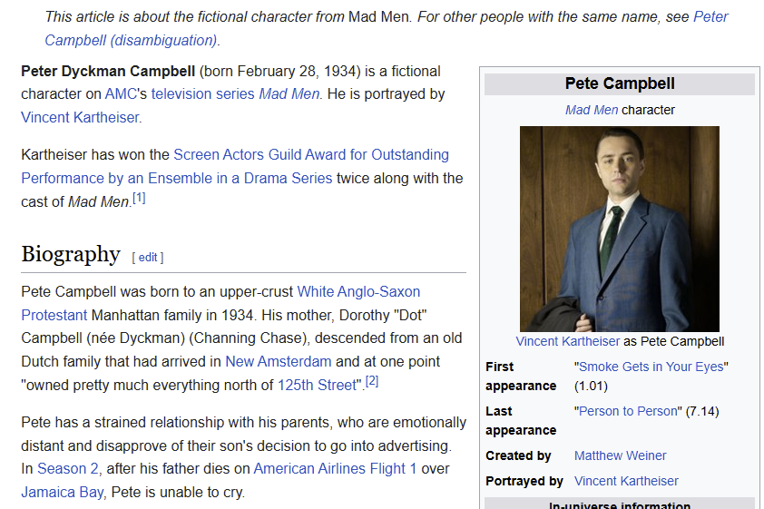

2. Don Draper 
   https://en.wikipedia.org/wiki/Don_Draper 

   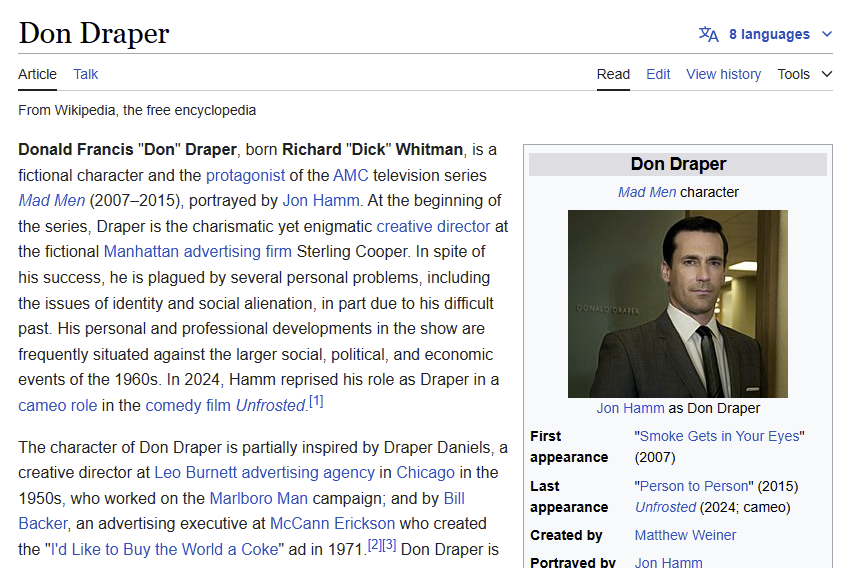

3. Iori Yagami
   https://en.wikipedia.org/wiki/Iori_Yagami 

   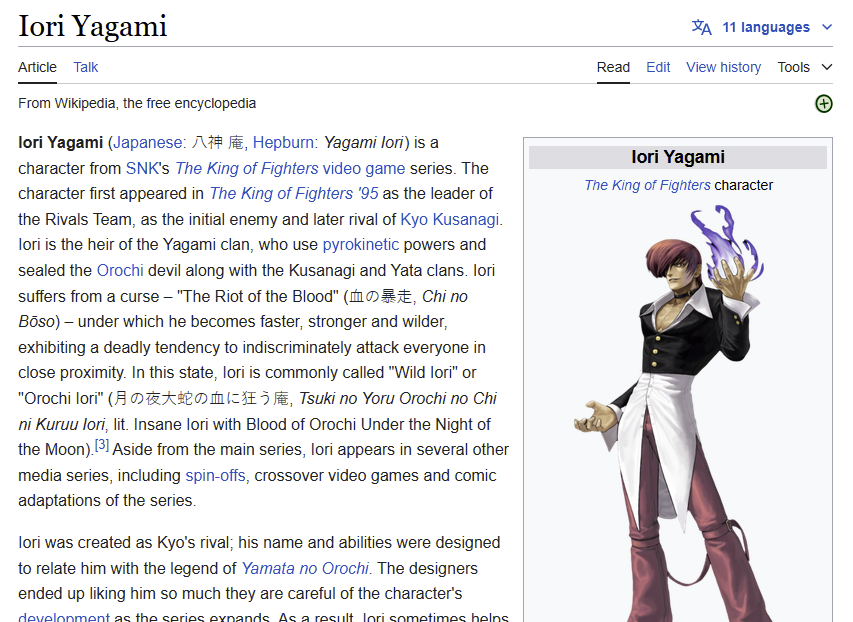

4. Ryohei Uchida
   https://en.wikipedia.org/wiki/Ry%C5%8Dhei_Uchida 

   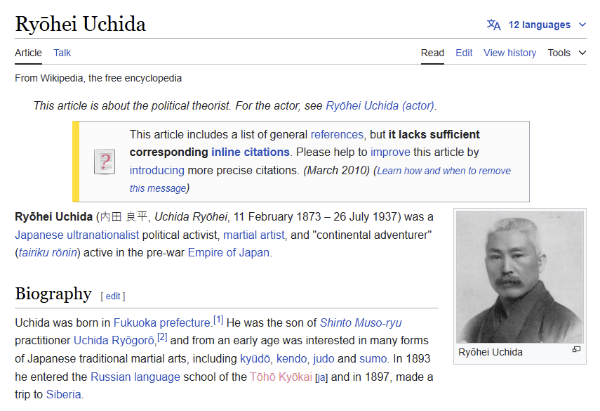

5. Tamerlane
   https://en.wikipedia.org/wiki/Timur 

   

6. R'as Al Ghul
   https://en.wikipedia.org/wiki/Ra%27s_al_Ghul 

   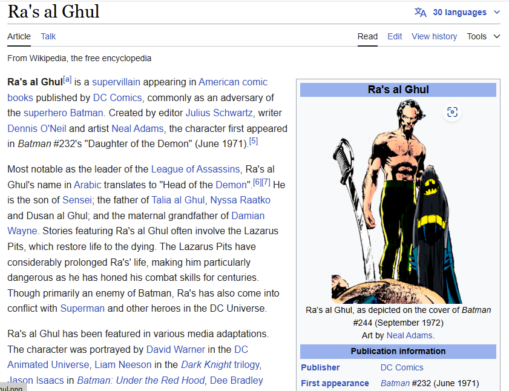

7. John Brennan
   https://en.wikipedia.org/wiki/John_Brennan_(CIA_officer) 

   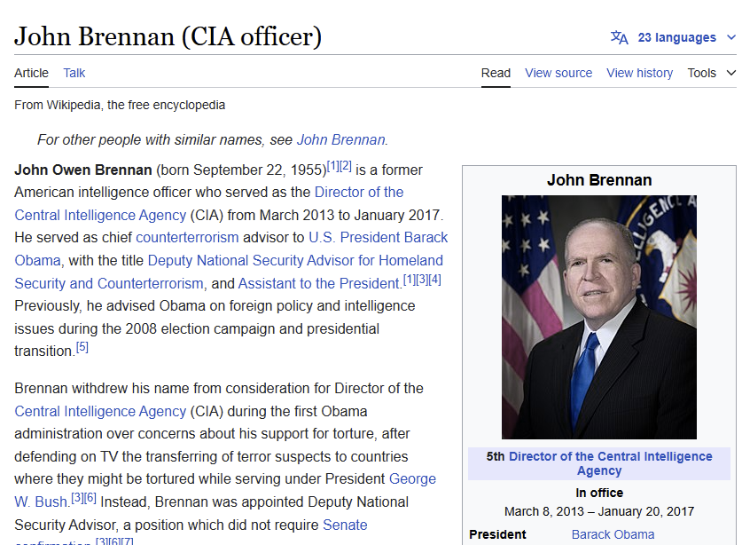

8. Ton Duc Thang
    https://en.wikipedia.org/wiki/T%C3%B4n_%C4%90%E1%BB%A9c_Th%E1%BA%AFng

   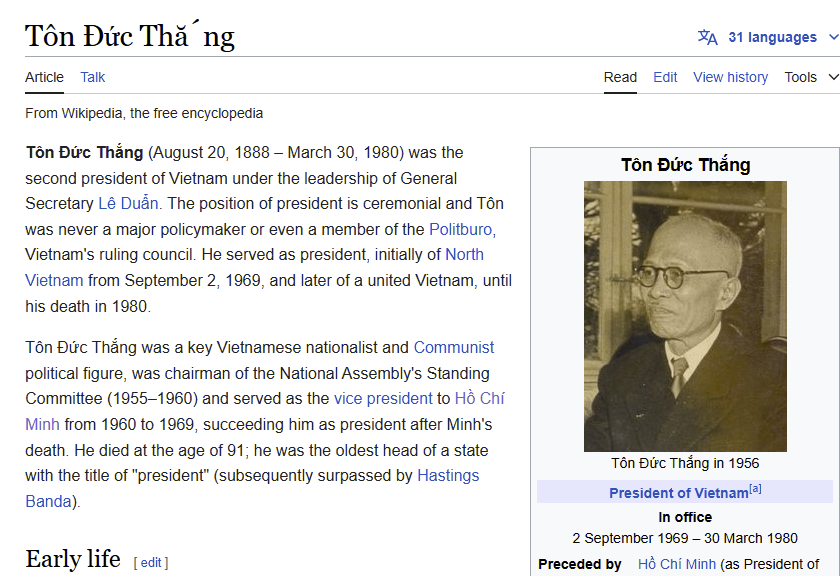 

9. Ngo Dinh Diem
    https://en.wikipedia.org/wiki/Ngo_Dinh_Diem 

   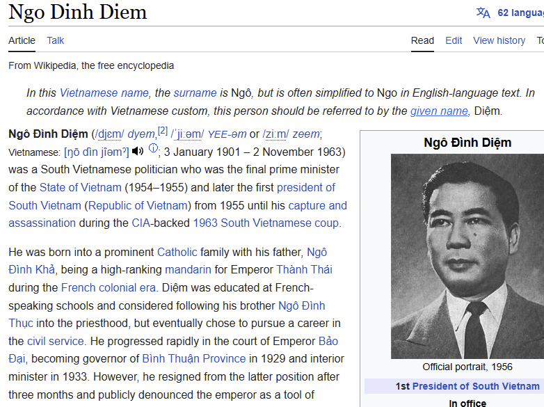 

10. Le Duan
    https://en.wikipedia.org/wiki/L%C3%AA_Du%E1%BA%A9n 

   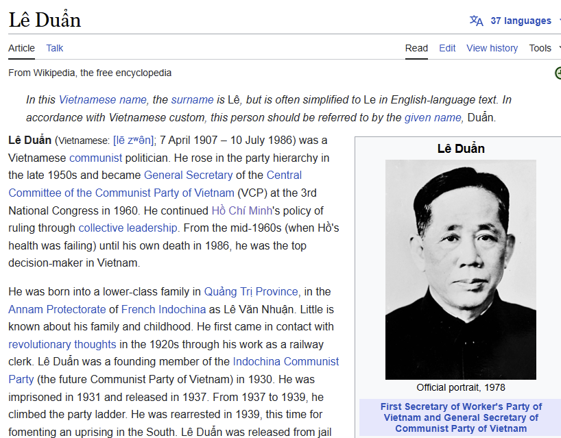 

11. Yang Kang
   https://en.wikipedia.org/wiki/Yang_Kang 

   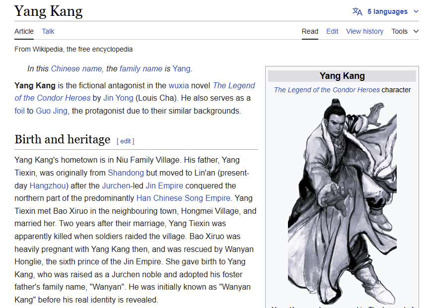

12. Rodrigo Duterte
    https://en.wikipedia.org/wiki/Rodrigo_Duterte 

   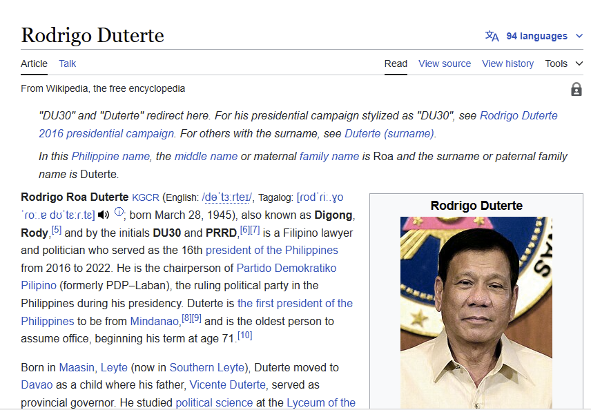

13. Baraka
    https://en.wikipedia.org/wiki/Characters_of_the_Mortal_Kombat_series#Baraka 

   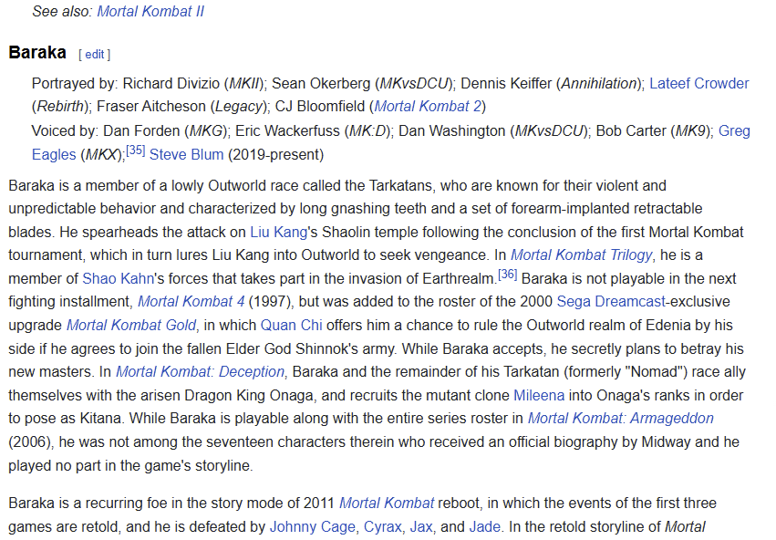

14. Ante Pavelic
    https://en.wikipedia.org/wiki/Ante_Paveli%C4%87 

   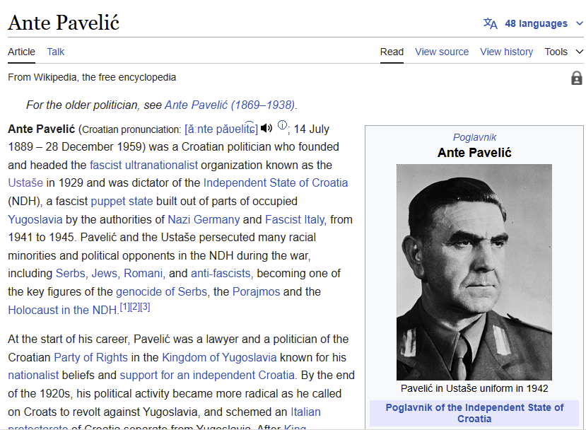

15. Charles de Gaulle
    https://en.wikipedia.org/wiki/Charles_de_Gaulle 

   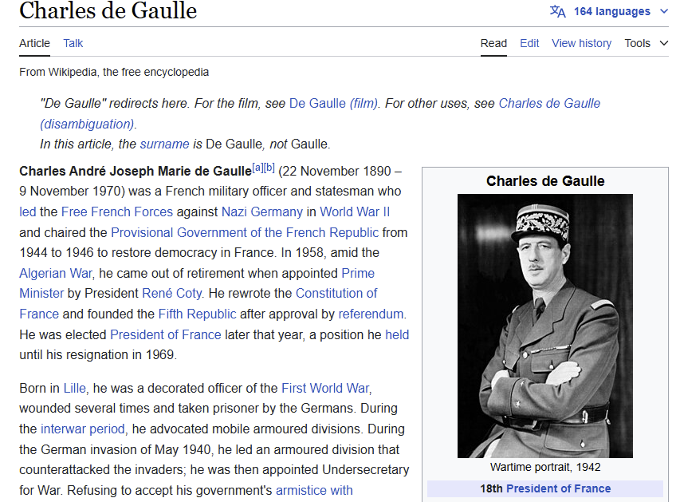

16. Carlos Slim
    https://en.wikipedia.org/wiki/Carlos_Slim 

   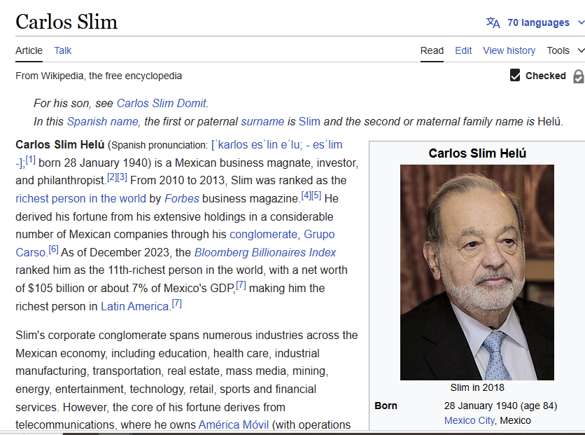

17. Chiang Kai-Shek
    https://en.wikipedia.org/wiki/Chiang_Kai-shek 

   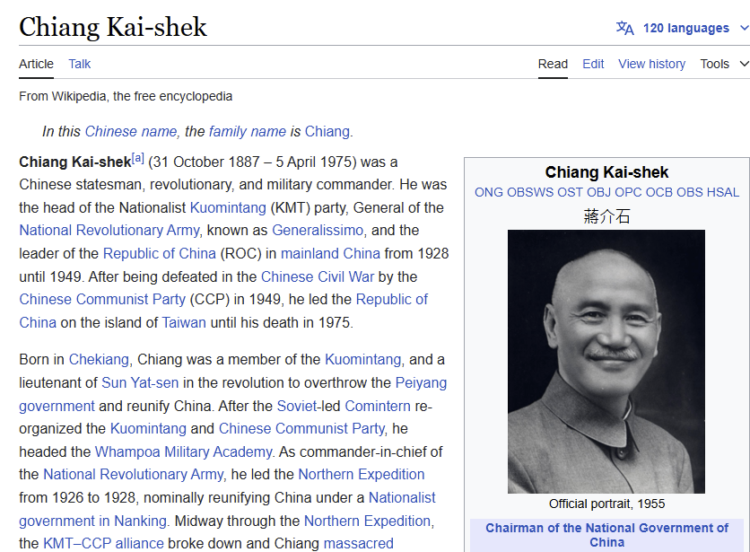
